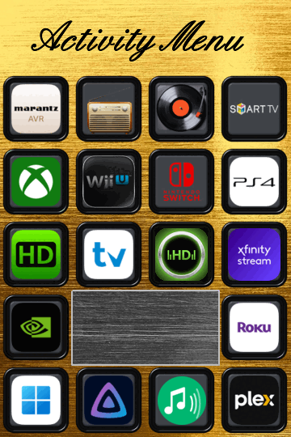
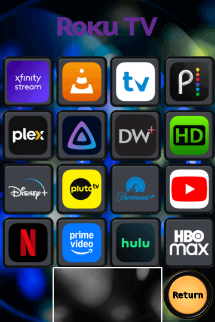
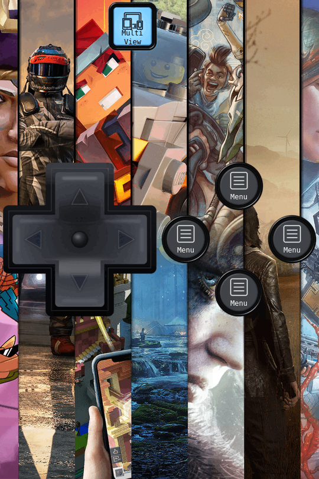

# Image_Fusionner

A PowerShell 7 + ImageMagick tool that turns a background image into a full grid of 90×90 PNG
tiles, then decorates individual tiles — or blocks of merged tiles — with buttons, icons, logos,
overlays, spanning pictures, text, transparent cut-outs, and window/island borders. What to draw
and where comes from a plain-text layout file, so a whole remote-control skin, app-launcher menu,
or tiled dashboard is described as a list of `r<row>c<col> = !element = name` lines instead of
being built by hand in an image editor.

Think of it like a recipe, not a program: **`Source_Images\` is your pantry of ingredients** —
buttons, icons, logos, overlays, backgrounds. **`Grid_layout\` is the recipe card** — a plain-text
list of which ingredients go on which tile, and how. **`script.ps1` is the kitchen** that follows
the recipe and does the actual cooking. **`Output_Images\` is the finished plate.** Nothing about
that relationship is hidden behind code — the recipe card is a `.txt` file you can read top to
bottom, and the pantry is just a folder of PNGs.

### Why this approach

- **Runs straight from the folder.** There's no installer, no setup wizard, nothing to register —
  ImageMagick is already bundled in `Bin\`. Copy the folder anywhere and it works.
- **100% local.** No website, no account, no cloud render queue, no subscription. Everything runs
  on your machine, on your files, with no dependency on some service staying online.
- **Easy to fix later.** If something looks off after the fact — a logo's off-centre, a label's
  the wrong colour — you edit one line in a `.txt` recipe and re-run. As long as `Source_Images\`
  and `Grid_layout\` still exist, the whole set can be rebuilt from scratch at any time; nothing
  is baked in that you can't get back to by reading the recipe.
- **Cheap to iterate.** The manifest cache means a small edit doesn't force a full re-render — only
  the background passes whose layout or assets actually changed get regenerated.
- **Ready for what's next.** If Unfolded Circle ever ships state-based icons (on/off, connected/
  disconnected, that sort of thing), you're basically already set up for it — that's just another
  `!icon` or `!overlay` line added to a tile that already exists in a recipe you already have.

This README doubles as a guide: it walks through one real layout end-to-end, then shows the rest
of the samples as input/output pairs, before dropping into full syntax reference.

---

## Requirements

- **PowerShell 7** (`pwsh`). The script also runs under Windows PowerShell 5.1.
- **ImageMagick** — bundled at `Bin\magick.exe`, already configured. Nothing else needs
  installing; the script shells out to that executable directly.
- **Windows** — stale-output cleanup goes through the Recycle Bin API, so the tooling assumes
  Windows.

---

## Folder structure

The script resolves its own location at runtime, so it can be launched from any working
directory as long as this layout stays intact:

```
Image_Fusionner\
    script.ps1                 <- the one file you run
    README.md                  <- this file

    Bin\
        magick.exe               <- ImageMagick (+ its support DLLs/xml/licence files)
        db\                      <- processing cache, created on first run

    Grid_layout\                 <- THE RECIPE CARDS — layouts that get PROCESSED, one run per .txt file
        Apps-Roku.txt
        Apps-Shield.txt
        Jump-Menu.txt
        Main&&rokuAV.txt
        Main&&rokuTV.txt
        Main&&shieldAV.txt
        Main&&shieldTV.txt
        Marantz.txt
        Samsung.txt
        Xbox-One.txt

    Layout Templates\            <- BLANK starter files, one per grid size — NOT processed
        layout_2x3.txt              here; copy one into Grid_layout\ to start a new layout
        layout_4x6.txt
        layout_6x9.txt
        layout_8x12.txt

    Source_Images\                <- THE INGREDIENTS
        Backgrounds\              <- images to be cropped and tiled
        Buttons\                  <- *.png, referenced with !button
        Icons\                    <- *.png, referenced with !icon
        Logos\                    <- *.png, referenced with !logo
        Overlays\                 <- *.png, referenced with !overlay
        Images\                   <- *.png, referenced with !image (spanning art & banners)

    Output_Images\                <- THE FINISHED PLATE: generated tiles + preview sheets, auto-created

    docs\examples\                <- static preview copies used by this README
```

**Only `Grid_layout\*.txt` gets rendered.** `Layout Templates\` is a library of blank starters —
nothing there runs until it's copied into `Grid_layout\`. Any missing source folder is created
automatically on first run (with a warning in the log), so a bare checkout with just `script.ps1`
and `Bin\magick.exe` still works.

> Folder names are plural (`Logos`, `Overlays`, `Images`); the layout keywords that read from
> them are singular (`!logo`, `!overlay`, `!image`). There's no `Banners\` folder — banners are
> built with `!image` from `Images\` (`!banner` is kept as an alias of `!image` for older
> layouts).

Backgrounds can be `.png`, `.jpg`, `.jpeg`, `.bmp`, `.tif`, `.tiff`, or `.webp`. Whatever the
format, each one is cropped to the grid's aspect ratio and resized with Lanczos filtering before
it's sliced into tiles.

---

## Quick start

1. Drop one or more background images into `Source_Images\Backgrounds\`.
2. Add the PNGs you'll reference into the matching element folder (`Buttons`, `Icons`, `Logos`,
   `Overlays`, `Images`) — or just use what's already there; the project ships with a sizeable
   library of remote-control buttons, device/app logos, and glyph icons.
3. Either work from an example or start fresh:
   - To learn the syntax by example, open one of the ten layouts already sitting in
     `Grid_layout\` — the [walkthrough](#walkthrough-from-layout-file-to-tile-set) and
     [gallery](#gallery-the-rest-of-the-samples) below cover exactly what each one does.
   - To start clean, copy the matching blank from `Layout Templates\` into `Grid_layout\`,
     rename it, and write the tiles you want.
4. Run it. Right-click **`script.ps1`** in File Explorer and choose **Run with PowerShell**:

   - **Windows 10** — it's right there in the normal right-click menu.
   - **Windows 11** — the default right-click menu is trimmed down; click **Show more options**
     at the bottom (or just hold **Shift** while right-clicking to jump straight to the full
     menu), and **Run with PowerShell** will be in that longer list.

   A console window opens, the log scrolls past, and the window closes itself when the run
   finishes.

5. Collect the results from `Output_Images\<LayoutName>\<Background>\`, plus a stitched preview
   image one folder level up — that stitched preview is exactly what the screenshots in this
   README show.

Every `.txt` sitting in `Grid_layout\` runs on each invocation — move or delete the ones you
don't want processed. The bundled samples each pin one specific background with
`!background = name`; the blank templates default to `!background = *all*` (every file in
`Backgrounds\`).

### If "Run with PowerShell" won't run the script

Windows's built-in **Run with PowerShell** command already works around the default execution
policy for that one run — so on most Windows 10/11 machines it just works, even though PowerShell
normally refuses to run unsigned scripts out of the box. Two things can still stop it:

- **The console flashes open and immediately closes with a "running scripts is disabled" (or
  similar) error.** This usually means the execution policy is locked down harder than default —
  common on a work/managed PC via Group Policy, less common on a personal machine. Open a regular
  PowerShell window (not as administrator) and run:

  ```powershell
  Set-ExecutionPolicy -ExecutionPolicy RemoteSigned -Scope CurrentUser
  ```

  Confirm with `Y` when prompted. This only changes the policy for your own user account, and only
  requires local scripts to run unsigned (still fine for `script.ps1`) — it doesn't weaken
  anything system-wide. If it errors with something like *"overridden by a policy defined at a
  more specific scope"*, that machine's execution policy is locked by an administrator and you'll
  need to run the script from an unlocked machine, or ask whoever manages that PC to allow it. See
  Microsoft's own reference on execution policies for the full picture:
  [about Execution Policies](https://learn.microsoft.com/en-us/powershell/module/microsoft.powershell.core/about/about_execution_policies).

- **"Run with PowerShell" isn't in the context menu at all, even under "Show more options."**
  That's rarer, and usually means the `.ps1` file association got changed by something else.

---

## Walkthrough: from layout file to tile set

`Jump-Menu.txt` is the smallest of the bundled layouts, so it's the clearest way to see the whole
pipeline in one pass — a 4×6 grid (24 tiles) over the `Brass` background, run as-is with no
edits. Here's what it produces:

**Input** — `Grid_layout\Jump-Menu.txt` (trimmed to the real instruction lines):

```text
!grid = 4x6
!background = Brass

r1c1, r1c2, r1c3, r1c4 = !text = "Activity Menu" [font="English157-BT", size=55, bold=yes]

r2c1 = !button = square_thick_black, !logo = marantz-avr-remote [radius=15, size=65, y=12.5, x=12.5]
r2c2 = !button = square_thick_black, !logo = radio [radius=15, size=60, y=15, x=18]
r2c3 = !button = square_thick_black, !logo = vintage-vinyl-record-player-spinning-classic-black-lp [radius=15, size=65, y=12.5, x=12.5]
r2c4 = !button = square_thick_black, !logo = samsung-smart-tv [radius=15, size=65, y=12.5, x=12.5]

# ... rows 3-4 follow the same button+logo pattern ...

r5c1 = !button = square_thick_black, !logo = nvidia-shield-tv [radius=15, size=65, y=12.5, x=12.5]
r5c2, r5c3 = !border [thickness=2, roundness=10, color=grey]
r5c4 = !button = square_thick_black, !logo = the-roku-app [radius=15, size=65, y=12.5, x=12.5]

r6c1 = !button = square_thick_black, !logo = Windows App Mobile [radius=15, size=65, y=12.5, x=12.5]
r6c2 = !button = square_thick_black, !logo = jellyfin-mobile [radius=15, size=65, y=12.5, x=12.5]
r6c3 = !button = square_thick_black, !logo = Squeezelite [radius=15, size=60, y=15, x=15]
r6c4 = !button = square_thick_black, !logo = plex [radius=15, size=65, y=12.5, x=12.5]
```

**Output** — the stitched preview at `Output_Images\Jump-Menu\Jump-Menu_Brass.png`:



Line by line, that's:

- **`!grid = 4x6`** sets a 4-column, 6-row grid — 24 tiles total, each rendered at 90×90.
- **`!background = Brass`** tells the script to crop and resize `Source_Images\Backgrounds\Brass.jpg`
  to `360×540` (4×90 wide, 6×90 tall) before slicing it into tiles.
- **`r1c1, r1c2, r1c3, r1c4 = !text = "Activity Menu" [...]`** lists four tiles on one line with a
  single `!text` element — because it's `!text` on a multi-tile line, the title is drawn *once*
  across the full 360×90 strip in the custom font, then sliced back into four 90×90 tiles so it
  reads as one continuous headline. This produces a **merged** filename:
  `jump_menu_r1-1c1-4-brass-text_activity_menu-1.png` through `...-4.png` (one file per tile in
  the group, sharing the same artwork).
- **`r2c1 = !button = square_thick_black, !logo = marantz-avr-remote [...]`** is a plain single-tile
  instruction: the black square button from `Buttons\` is drawn first, then the Marantz logo from
  `Logos\` on top of it, shrunk to `65x65`, rounded to a `15`px radius, and nudged `12.5`px in
  from the top-left. Because button layers don't appear in filenames, this tile is saved as
  `jump_menu_r2c1-brass-logo_marantz_avr_remote.png`.
- **`r5c2, r5c3 = !border [...]`** greyscales those two tiles into a "window," then draws a grey
  frame stripe on the tiles that abut them (`r5c1`, `r5c4`, and the row above/below) — the flat
  grey box visible in row 5 of the screenshot. The window tiles themselves are saved as
  `jump_menu_r5c2-brass-border.png` and `jump_menu_r5c3-brass-border.png`.

Every tile not mentioned in the file — there are none left over in this particular layout, since
all 24 tiles are covered — would otherwise be written out as a plain 90×90 background crop with
no suffix at all, e.g. `jump_menu_r3c4-brass.png`.

---

## Gallery: the rest of the samples

Each of these ships ready to run in `Grid_layout\`. The snippets below are real excerpts, and the
images are the actual stitched previews the script produced from them.

### Apps-Roku.txt / Apps-Shield.txt — 4×6, an app-launcher grid

A `!image` banner across the top two tiles, a 4×4 grid of streaming-app logos on framed buttons,
a `!border` divider, and a labelled Return button:

```text
!grid = 4x6
!background = apps-background

r1c2, r1c3 = !image = roku banner
r2c1 = !button = square_button_framed_thin [size=90], !logo = xfin [roundness=15, size=70, y=12, x=12]
r2c2 = !button = square_button_framed_thin [size=90], !logo = vlc-media-player [roundness=15, size=70, y=12, x=12]
# ... 14 more logo tiles, rows 2-5 ...
r6c2, r6c3 = !border [roundness=5, thickness=2, color=white]
r6c4 = !button = round_thick_amber, !text = "Return" [size=14, bold=yes, color=black]
```



### Samsung.txt — 6×9, a TV remote

A top `!image` logo banner, a framed `!image` d-pad spanning a 3×3 block, icon+text buttons
around it, `!border` and `!frame` groupings, and an HDMI-input row:

```text
!grid = 6x9
!background = black-textured

r1c1, r1c2, r1c3, r1c4, r1c5, r1c6 = !image = samsung-logo
r3c2 = !button = round_thick_black, !icon = Help [size=35, x=27.5, y=18], !text = "Help" [y=18, size=12]
r3c3, r3c4, r3c5, r4c3, r4c4, r4c5, r5c3, r5c4, r5c5 = !image = av_remote_dpad_framed_each
r7c3, r7c4, r7c5 = !border [thickness=2, roundness=5, color=blue]
r9c2, r9c3, r9c4, r9c5 = !frame [thickness=2, roundness=5, color=blue]
r9c2 = !button = square_thick_coolwhite, !icon = HDMI [size=35, x=27.5, y=18, color=black], !text = "HDMI 1" [y=18, size=12, color=black]
```


### Marantz.txt — 6×9, a dense AV-receiver remote

The busiest sample: hex-coloured `!border` windows, a `!frame` running the full right-hand
column, a d-pad `!image` across a 3×3 block, `!image` up/down pads across vertical tile pairs,
and roughly twenty labelled buttons:

```text
!grid = 6x9
!background = bru_alum

r1c2, r1c3, r1c4 = !border [color=#9d845b]
r1c6, r2c6, r3c6, r4c6, r5c6, r6c6, r7c6 = !frame [thickness=2, roundness=5, color=white]
r3c2, r3c3, r3c4, r4c2, r4c3, r4c4, r5c2, r5c3, r5c4 = !image = av_remote_dpad_backlit_coolwhite
r7c1, r8c1 = !image = updown_thick_black
r9c1, r9c2, r9c3, r9c4, r9c5, r9c6 = !image = marantz_banner
```


### Xbox-One.txt — 6×9, a sparse controller layout

A transparent SNES-style d-pad `!image` spread across a 3×3 block sitting directly over the
background art, plus a handful of icon+text menu buttons:

```text
!grid = 6x9
!background = xbox-background

r1c3 = !button = square_thick_iceblue, !icon = MultiView [size=35, x=27.5, y=18, color=black], !text = "Multi<br>View" [y=18, size=12, color=black]
r4c1, r4c2, r4c3, r5c1, r5c2, r5c3, r6c1, r6c2, r6c3 = !image = dpad_snes_transparent
r4c5 = !button = round_thick_black, !icon = Menu [size=35, x=27.5, y=18], !text = "Menu" [y=18, size=12]
```



### Main&&rokuAV / Main&&rokuTV / Main&&shieldAV / Main&&shieldTV — 6×9, remote "home" screens

Four device-specific home screens sharing one design: a `!frame` island across the whole top row
and another across the bottom two rows, a large spanning `!text` mode title, glass-plate
`!overlay` buttons, and a bottom banner. They demonstrate the
[`&&` filename trick](#the--filename-trick) — four `.txt` files, four output folders, one shared
`main_` file prefix:

```text
!grid = 6x9
!background = bru_alum2

r1c1, r1c2, r1c3, r1c4, r1c5, r1c6 = !frame [thickness=4, roundness=10, color=white]
r1c1 = !button = round_thick_black, !overlay = geometric_shape_glass_plate [size=80, x=5, y=5], !text = "Home<br>Assistant" [size=10, bold=yes]
r1c2, r1c3, r1c4, r1c5 = !text = "TV Mode" [size=65, bold=yes, italic=yes]
r1c6 = !button = round_thick_black, !overlay = geometric_shape_glass_plate [size=80, x=5, y=5], !text = "Samsung<br>Remote" [size=10, bold=yes]
r9c1, r9c2, r9c3, r9c4, r9c5, r9c6 = !image = roku banner
```


(`Main&&rokuTV.txt` -> output folder `Output_Images\Main-rokuTV\`, files prefixed `main_...`.)

---

## Layout file reference

A layout is a `.txt` file in `Grid_layout\`. It picks a grid size, chooses which background(s) to
run against, optionally sets a diorama effect, and then lists per-tile instructions.

- Blank lines are ignored.
- `#` starts a comment — everything after it on the line is dropped, whether the line is a whole
  comment or the comment trails real content.

### File-level directives

```text
!grid = 4x6                 # one of: 2x3, 4x6, 6x9, 8x12 (anything else falls back to 4x6)
!background = *all*         # process every image in Source_Images\Backgrounds
!background = sunset        # process only sunset.<ext> (matched without the extension)
!diorama = Tilt-shift        # optional per-layout effect override — see Diorama effects
```

`!grid` is `<columns>x<rows>`; all four supported grids share a 2:3 aspect ratio (`4x6` = 4 wide
× 6 tall = 24 tiles, `6x9` = 54 tiles, and so on). `!diorama` (`none` / `Tilt-shift` / `Shadowbox`,
case-insensitive) overrides the script's global `$DioramaMode` for this layout only; leave it out
to inherit the global setting.

### Tile instructions

A tile is named `r<row>c<col>`, one-based, row before column — `r1c1` is the top-left tile. One
instruction maps one or more comma-separated tiles to a comma-separated list of elements:

```text
r1c1 = !button = play, !icon = star, !text = "Watch Now"
```

**Elements are layered left → right = bottom → top.** In that example the button is drawn first,
the star icon on top of it, and the text on top of both.

Listing several tiles before the `=` applies the instruction to the whole group at once:

```text
r1c1, r1c2, r2c1, r2c2 = !logo = netflix
```

### Elements

| Element | Example | Reads from | Behaviour |
|---|---|---|---|
| `!button` | `!button = play` | `Buttons\` | Plain overlay: size, opacity, X/Y offset. |
| `!icon` | `!icon = star` | `Icons\` | Overlay with rounded corners, opacity, X/Y, and an optional flat recolour. |
| `!logo` | `!logo = netflix` | `Logos\` | Overlay with rounded corners, opacity, X/Y. |
| `!overlay` | `!overlay = glass` | `Overlays\` | Full-tile overlay (glass plate, frame graphic, etc.): size, opacity, X/Y. |
| `!image` | `!image = topbar` | `Images\` | Scales one picture across a **block** of tiles, then slices it back into 90×90 pieces. |
| `!text` | `!text = "Play"` | — | Font, size, colour, opacity, gravity, X/Y offset, plus faux bold/italic/underline. |
| `!border` | `!border` | — | Greyscales the listed "window" tiles and draws a frame on the tiles that abut them. |
| `!frame` | `!frame` | — | The inverse of `!border`: frames an "island" of tiles on its outward edges. |
| `!clear` | `!clear` | — | Makes the tile's background transparent (or faded, with an opacity override). |

Asset names are given **without** the `.png` extension, and every asset must be a PNG.
`!boarder` is accepted as a spelling alias of `!border`; `!banner` as an alias of `!image`.

> `!button = *all*` isn't supported — name a specific button per tile.

Text supports manual line breaks with `<br>`, as seen in the gallery's `"Home<br>Assistant"` and
`"Multi<br>View"` labels above.

### Multi-tile behaviour

Listing more than one tile on an instruction behaves differently depending on the element — the
walkthrough above shows the `!text` and `!border` cases in practice:

- **`!logo` (and any other single-image element used as a general merge)** — the listed tiles are
  cut from the background as one region, resized down to a single 90×90 image, decorated, and
  that *same* finished image is copied into every tile slot in the group. Good for one big
  centred logo spanning several tiles while still producing the full tile count.
- **`!image`** — one picture is scaled across the whole block (fitted to keep its aspect ratio by
  default, or stretched to fill with `[aspect=no]`), then **sliced** back into individual 90×90
  tiles so the picture spreads across them. This is also how banners are made: list a full row
  and add `[aspect=no]` — see the Marantz and Roku banners in the gallery.
- **`!text`** — drawn once across the whole block at full resolution, then sliced into tiles, so
  the text spans them (the "Activity Menu" and "TV Mode" headlines above). Putting `!text` on a
  multi-tile line switches the *entire* line into this block/span mode — any other element on
  that same line is rendered once across the block too.
- **`!border` / `!frame`** — the frame is drawn per sub-cell so its stripe lines up correctly
  across the abutting edges of a merged block.

### Per-element overrides

Any element value can be followed by a `[ ... ]` block that overrides the script's global
defaults **for that element only** on that one line. Anything left out keeps its global value —
the gallery snippets above are full of these in practice (`[radius=15, size=65, y=12.5, x=12.5]`,
`[thickness=2, roundness=5, color=blue]`, and so on).

```text
!button = play    [size=50x50, x=20, y=20, opacity=85]
!icon   = star    [size=40x40, radius=8, opacity=90, color=white]
!logo   = netflix [size=70x70, x=10, y=10, radius=10]
!overlay = glass  [size=90x90, opacity=60]
!image  = topbar  [aspect=no, x=10, y=10, opacity=85]
!text   = "LIVE"  [font=DejaVu-Sans, size=16, color=yellow, gravity=South, bold=yes]
!border           [style=Raised, color=white, thickness=12, roundness=20]
!frame            [style=Raised, color=white, thickness=10, roundness=20, greyscale=yes]
```

Recognised keys (aliases in parentheses):

| Key | Applies to | Meaning |
|---|---|---|
| `size` (`s`) | button / icon / logo / overlay / image / text | ImageMagick geometry, e.g. `50x50` |
| `x` (`posx`) | all | horizontal offset in pixels from the gravity anchor |
| `y` (`posy`) | all | vertical offset in pixels from the gravity anchor |
| `opacity` (`op`, `o`) | button / icon / logo / overlay / image / clear | `0`–`100` |
| `radius` (`r`, `corner`) | icon / logo | rounded-corner radius in pixels |
| `color` (`colour`, `c`) | icon (recolour) / text | colour name or `#RRGGBB` |
| `font` (`f`) | text | ImageMagick font name |
| `bold` (`b`) | text | `yes`/`no` — faux bold |
| `italic` (`i`, `italics`) | text | `yes`/`no` — faux italic (shear) |
| `underline` (`u`, `ul`) | text | `yes`/`no` — draw an underline rule |
| `gravity` (`g`) | text / image | ImageMagick gravity: `Center`, `North`, `South`, … |
| `aspect` (`ar`) | image | `yes` = fit within the block, `no` = stretch to fill |
| `style` (`st`) | border / frame | `Flat Solid` / `Beveled 3D` / `Raised` |
| `thickness` (`t`, `width`) | border / frame | stripe width in pixels |
| `roundness` (`round`) | border / frame | outer-corner radius in pixels |
| `greyscale` (`grey`, `gs`) | frame | `yes`/`no` — desaturate the tiles surrounding the island |

Yes/no keys accept `y/yes/on/true` and `n/no/off/false`.

> Don't use `rgb(r,g,b)` colours inside `[ ]` — the commas get read as key separators. Use a
> colour name (`white`) or hex (`#1a2b3c`) instead, as the gallery examples do (`#9d845b`,
> `color=blue`).

`!icon color` recolours the whole icon to a flat colour — the Samsung sample uses this to turn
white glyph icons black on light buttons (`!icon = Help [color=...]` isn't used there, but
`!icon = MultiView [color=black]` on Xbox-One is exactly that trick). `!text color` sets the text
colour. Bold, italic, and underline are **faux** styles drawn with ImageMagick primitives rather
than a real bold/italic font face, so they work with any font — see `"TV Mode"` above
(`bold=yes, italic=yes`).

---

## Diorama effects

A single switch — the script's global `$DioramaMode`, or a per-layout `!diorama` directive —
selects one optional treatment for a background before it's split into tiles. None of the bundled
samples turn this on, so it's off by default in every screenshot above.

- **`none`** — no effect (the default).
- **`Tilt-shift`** — a miniature/"tiny model" look: a sharp horizontal focus band with everything
  else blurred, plus a saturation and contrast boost. It's applied to the whole background
  *before* it's split, so every tile, merged region, and image-slice inherits it consistently;
  buttons, icons, logos, and text are composited afterward and stay crisp on top.
- **`Shadowbox`** — 3D recessed-window depth that enhances `!border`: the greyscale window tiles
  get an inner shadow along their outward-facing edges so the cut-out reads as sinking into a
  box. It has no visible effect on a layout that doesn't use `!border`, and it doesn't touch
  `!frame` islands.

The two effects are independent under the hood, so this is a single either/or switch rather than
something that can be layered.

---

## Configuration reference

Every tunable lives in a clearly-commented block near the top of `script.ps1`; paths are resolved
automatically at runtime. Sizes are ImageMagick geometry strings, positions are pixel offsets
from a gravity anchor, and opacity is `0`–`100`. Current defaults:

- **Tile** — `90` px (the whole pipeline assumes square 90×90 output).
- **Button** — size `85x85`, offset `2.5`/`2.5`, opacity `100`.
- **Icon** — size `60x60`, offset `15`/`15`, opacity `100`, corner radius `4`, no recolour by
  default.
- **Logo** — size `60x60`, offset `15`/`15`, opacity `100`, corner radius `10`.
- **Overlay** — size `90x90`, offset `0`/`0`, opacity `100`.
- **Image** — keeps aspect ratio, auto-fits the block by default, offset `0`/`0`, opacity `100`,
  gravity `Center`.
- **Text** — font `DejaVu-Sans-Mono` (validated at startup, with an automatic fallback if it's
  missing), size `14`, colour `white`, offset `0`/`0`, opacity `100`, gravity `Center`;
  bold/italic/underline off by default.
- **Border** — style `Flat Solid`, colour `black`, thickness `3`, roundness `25`.
- **Frame** — style `Flat Solid`, colour `black`, thickness `5`, roundness `16`, surrounding
  tiles left in colour (`greyscale = no`).
- **Diorama** — off by default; tilt-shift and shadowbox each have their own blur/focus/shadow
  tuning variables alongside the mode switch.
- **Output encoding** — zlib compression level `9`, adaptive row filter, metadata stripped,
  reduced to a 64-colour PNG8 palette (biggest size win, can band smooth gradients — tiles with
  transparency automatically skip palette quantization to avoid alpha artifacts).
- **Cleanup / preview / cache** — stale output files are recycled (not deleted) after each run, a
  stitched preview sheet is rebuilt every run, and a manifest cache skips regenerating a
  background pass whose inputs haven't changed.

Open `script.ps1` itself for the full, individually-commented list — every setting above has its
own explanation right next to the variable. Every override in the gallery snippets above is a
per-line exception to one of these global defaults.

---

## Output structure & file naming

```
Output_Images\
    <LayoutName>\
        <LayoutName>_<Background>.png     <- stitched preview sheet (this is what's embedded above)
        <Background>\
            <tiles...>.png
```

Every `<Background>` folder always contains the **complete** tile set for the chosen grid (24
files for 4×6, 54 for 6×9, and so on) — tiles that weren't touched by any instruction are still
written out as plain background crops.

Filenames are prefixed with the layout name and encode the tile position, background, and any
decorating elements that landed on that tile:

```
<LayoutName>_r<row>c<col>-<background>[-icon_<x>][-logo_<y>][-image_<z>][-border][-frame][-text_<t>].png
```

Real example from the walkthrough above: `jump_menu_r2c1-brass-logo_marantz_avr_remote.png`.

Merged groups use the row/column span plus an index within the group instead of a single
`r<row>c<col>`:

```
<LayoutName>_r<R0>-<R1>c<C0>-<C1>-<background>[-tags]-<n>.png
```

Real example: `jump_menu_r1-1c1-4-brass-text_activity_menu-1.png`.

### The `&&` filename trick

Putting `&&` in a **layout's filename** splits the output folder name from the per-file prefix.
The whole name (with each `&&` turned into a `-`) becomes the folder, but only the part **before**
the first `&&` becomes the filename prefix:

```
Main.txt           -> folder Main\           files main_r1c1-...
Main&&rokuTV.txt   -> folder Main-rokuTV\    files main_r1c1-...   ("rokuTV" is dropped from the prefix)
Main&&shieldAV.txt -> folder Main-shieldAV\  files main_r1c1-...
```

This is exactly how the four `Main&&...` samples in the gallery above stay in four separate
output folders (`Main-rokuAV`, `Main-rokuTV`, `Main-shieldAV`, `Main-shieldTV`) while every file
in all four shares one `main_` prefix.

---

## Caching, cleanup & preview

- **Manifest cache** (`Bin\db\`): each background pass records a signature covering the layout
  text, every source asset under `Source_Images\`, and the relevant config values. On the next
  run, a pass whose signature is unchanged *and* whose output files all still exist is skipped —
  this is the main speed-up on repeat runs. Any change under `Source_Images`, or to the layout or
  config, invalidates the cache automatically, so it never serves stale output.
- **Stale-file cleanup**: after writing a background's folder, any *other* file already sitting
  there (left over from a renamed element or removed asset) is sent to the Recycle Bin rather
  than permanently deleted, so it can be restored if needed.
- **Preview / contact sheet**: the tiles are stitched back into one full image at
  `Output_Images\<LayoutName>\<LayoutName>_<Background>.png` for quick inspection — this is the
  exact mechanism behind every screenshot in this README. It's rebuilt from whatever tiles are
  currently on disk, so it stays accurate even when the tile pass itself came from cache.

---

## Troubleshooting

- **"ImageMagick not found"** — check that `Bin\magick.exe` exists and hasn't been moved.
- **Font warning at startup** — the configured text font isn't installed; the script falls back
  to another available font automatically. Run `magick identify -list font` to see valid names.
- **"`!button = *all*` was removed"** — name a specific button per tile; the all-buttons wildcard
  isn't supported.
- **"Unknown element" warning** — a `!something` in a layout isn't a recognised keyword; check the
  spelling against the [Elements](#elements) table.
- **A background is skipped entirely** — a `!background = name` filter didn't match any file in
  `Backgrounds\` (matching ignores the extension), or the folder is empty.
- **A tile is skipped** — the instruction referenced a tile outside the chosen grid (e.g. `r5c1`
  on a `2x3` layout).
- **Colours inside `[ ]` misbehave** — `rgb(r,g,b)` was used; its commas get parsed as override
  separators. Use a colour name or hex code instead.
